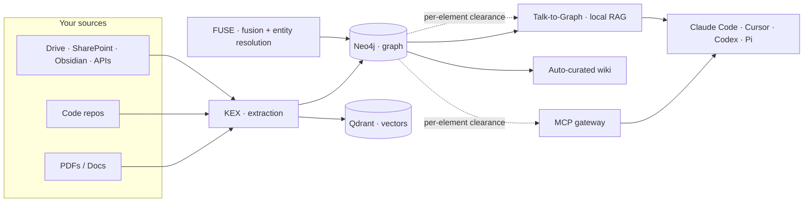

<div align="center">

# Ground Control (GCTRL)

### The knowledge-infrastructure layer for enterprise AI.
**Ground your data. Command your AI.**

[](https://github.com/GCTRL-TECH/platform/actions/workflows/build-push.yml)
[](./LICENSE)
[](#-quick-start)
[](#-access-control--compliance)
[](#-quick-start)

</div>

---

GCTRL turns your scattered documents, databases, and code into **one governed knowledge graph** — then grounds your LLMs and agents on it, with enterprise-grade access control, **entirely on your own infrastructure**.

Most "AI memory" is a pile of vector chunks: fuzzy recall, no structure, no provenance, no permissions. GCTRL is **graph-native** — entities, typed relations, dossiers, and hybrid retrieval — and it runs **100% locally**, so nothing leaves your building.

> **The pitch in one line:** point GCTRL at your data, get a governed knowledge graph, and let any agent (Claude Code, Cursor, Codex…) read and write it as durable, access-controlled memory.

---

## ✨ Why GCTRL

- **🕸️ Graph-native, not a vector blob.** Entities, typed relations, entity *dossiers*, and hybrid retrieval (dense + keyword + graph traversal) — with provenance on every fact. Ask *"how does X connect to Y?"* and get a real answer, not a fuzzy guess.
- **🔒 100% self-hosted, local inference.** Runs on your hardware with local Ollama. DSGVO/GDPR by design — RAG sessions live in browser memory, no conversation is stored server-side, no data leaves your network.
- **🛡️ Access control built for the enterprise.** Per-element classification and clearance, scoped colleague tokens, airtight multi-project isolation, and a full audit trail. Designed ISO 27001-aware, with TISAX Level 3 as the north star.
- **🤖 Drop into any agent.** One MCP config and Claude Code, Cursor, Codex, or any MCP client gets durable, governed, graph-native memory — plus a built-in **Pi** agent.
- **⚙️ Self-maintaining memory.** Heat/decay/trust scoring, semantic dedup, community detection, and an auto-curated wiki keep the graph clean and useful over time.
- **🎯 Near-SOTA entity resolution — unsupervised and on-device.** The fusion core resolves duplicates and contradictions across systems without labels and without the cloud.

---

## 🧩 The platform

GCTRL is four modules over one graph, plus an agent layer:

| Module | What it does |
|---|---|
| **KEX** — Knowledge Extraction | Point it at PDFs, docs, plain text, or a **code repo** → it extracts entities and typed relations into the graph. Local NER + local relation extraction, zero cloud. Code is parsed via AST into files/classes/functions/imports/calls. |
| **FUSE** — Knowledge Fusion | Merge many sources and graphs into one **canonical** graph. Deterministic entity resolution and link discovery reconcile duplicates and contradictions across systems. |
| **Manage KGs** | Organize knowledge into compilations, schedule incremental or full refreshes, and gate every node, edge, and chunk by clearance level. |
| **Talk-to-Graph** | GDPR-compliant RAG over your graph. Local inference; sessions stay in browser memory — **no server-side conversation storage.** |
| **Pi + MCP gateway** | A built-in agent, plus an MCP server so external agents get governed memory: `store`, `query`, `get_dossier`, `search_entities`, `get_neighbors`, `shortest_path`, `ingest_repo`, and more. |

---

## 🚀 Quick start

One command brings up the whole stack:

```bash
curl -fsSL https://gctrl.tech/install | bash
```

When it finishes, open the dashboard at **`http://localhost:3001`** and create your admin account. The installer detects what you already run (graph store, vector store, local LLM), deploys only what's missing, and pulls a local model so you can start immediately.

Full walkthrough — install → connect a model → activate a license → connect an agent → ingest your first PDF: **[gctrl.tech/docs/quickstart](https://gctrl.tech/docs/quickstart)**.

Uninstall (keep data) / full reset:

```bash
curl -fsSL https://gctrl.tech/uninstall | bash               # keep your data
curl -fsSL https://gctrl.tech/uninstall | bash -s -- --purge  # wipe everything
```

---

## 🔌 Connect your agent (MCP)

Give any MCP-capable agent durable, access-controlled memory over your graph. Generate a scoped token in **Settings → Agent**, then drop this into Claude Code, Cursor, Codex, or Claude Desktop:

```jsonc
{
  "mcpServers": {
    "gctrl": {
      "type": "http",
      "url": "http://localhost:4000/api/agent/mcp",
      "headers": { "Authorization": "ApiKey YOUR_TOKEN" }
    }
  }
}
```

Your agent now reads and writes a real knowledge graph — scoped to exactly what its token is cleared for. See **[Agents & MCP](https://gctrl.tech/docs/agents-mcp)**.

---

## 🛡️ Access control & compliance

GCTRL is built for regulated, multi-tenant environments:

- **Per-element classification.** Every node, edge, chunk, and wiki page carries its own clearance level — enforced at query time, not by a folder rule someone can forget.
- **Airtight project isolation.** Scope a colleague's (or agent's) token to specific knowledge bases. An agent on Client A's project literally cannot retrieve, cite, or leak Client B's data — not even by accident.
- **GDPR by design.** Local inference, browser-memory chat sessions, opt-in and erasable personalization.
- **Audit trail.** Token, action, resource, outcome — every grant and every denial is logged.

Designed ISO 27001-aware, aimed at TISAX Level 3 readiness. See **[Access Control](https://gctrl.tech/docs/access-control)** and **[Compliance & Sovereignty](https://gctrl.tech/docs/compliance)**.

---

## 📊 Benchmarks

The fusion core (entity resolution / link discovery) is competitive with **supervised** state-of-the-art — while running **unsupervised and fully on-device**:

| Task | GCTRL (unsupervised, local) | Supervised SOTA |
|---|--:|--:|
| Clean structured records (DBLP-ACM) | **F1 0.967 – 0.976** | ~0.989 |
| Dirty textual records (Abt-Buy) | **F1 0.866** | ~0.891 |

No labels, no cloud, your data never leaves the machine. More in **[Benchmarks](https://gctrl.tech/docs/benchmarks)**.

---

## 🏗️ Architecture



A Rust control plane orchestrates Python extraction/fusion workers, a React UI, and local inference — all over Docker Compose.

---

## 🧪 Tech stack

- **Control plane:** Rust (Axum) API + agent sidecar
- **Workers:** Python (KEX extraction, FUSE fusion)
- **Frontend:** React + Vite (dashboard + license portal)
- **Stores:** Neo4j (graph) · Qdrant (vectors) · PostgreSQL · Redis
- **Inference:** local Ollama (multi-provider configurable)
- **Packaging:** Docker Compose, one-line installer

---

## 📚 Documentation

Full docs at **[gctrl.tech/docs](https://gctrl.tech/docs)**:

- [Quick Start](https://gctrl.tech/docs/quickstart) · [Installation](https://gctrl.tech/docs/installation)
- [Architecture](https://gctrl.tech/docs/architecture) · [The Four Modules](https://gctrl.tech/docs/modules) · [Memory Layers](https://gctrl.tech/docs/memory-layers)
- [Agents & MCP](https://gctrl.tech/docs/agents-mcp) · [Access Control](https://gctrl.tech/docs/access-control) · [Compliance](https://gctrl.tech/docs/compliance)
- [Benchmarks](https://gctrl.tech/docs/benchmarks) · [FAQ & Troubleshooting](https://gctrl.tech/docs/faq)

---

## ⚠️ Before production — change the default secrets

The bundled compose files ship with **well-known placeholder secrets** (`POSTGRES_PASSWORD`, `NEO4J_PASSWORD`, `JWT_SECRET`, …) so GCTRL runs out of the box on localhost. **Set your own real values** (via a local `.env`, never committed) before exposing GCTRL to a network. A predictable `JWT_SECRET` lets anyone forge admin tokens; default DB passwords are public knowledge.

---

## 📄 License

GCTRL is **dual-licensed**:

- **Open source — GNU AGPL-3.0** ([`LICENSE`](./LICENSE)): free to use, modify, and self-host, as long as your own stack stays open under the AGPL.
- **Commercial license**: for proprietary / closed-source or hosted use **without** AGPL copyleft obligations.

See **[`LICENSING.md`](./LICENSING.md)** for what each option allows and how to obtain a commercial license.

---

## 🙏 Built with

GCTRL stands on excellent open-source work. Full third-party notices and licenses: **[`docs/LICENSES.md`](./docs/LICENSES.md)**.

Neo4j · Qdrant · Ollama · GLiNER · Qwen · PostgreSQL · Redis · React · Rust / Axum · FastAPI · LIMES.

---

<div align="center">
<sub>© Cinque Monti Ltd. — GCTRL (Ground Control). Built for enterprises that refuse to hallucinate.</sub>
</div>
